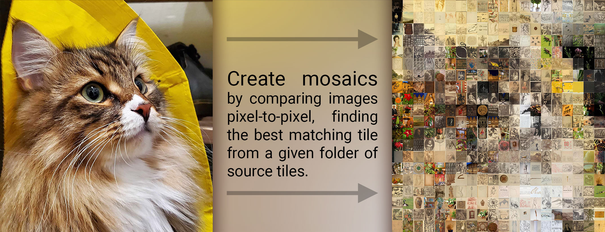

# ImageCollage

A script that creates a photo mosaic by comparing sub-tile pixels for a higher quality result.

  

This script works differently than most others because it doesn't just treat each image tile as one pixel, but instead compares the contents of the image (using a limited, configurable resolution), and finds the best match.

This, of course, is much slower than other methods like mapping tiles to pixels, or just overlaying the source image on the final image. However, the results look much nicer, too (at least, in my opinion).  
In order to speed up the process, imported image tiles are first converted into Numpy arrays, and fast np.array math is used to compare tiles and find the best matches.

  

## How this differs from other methods of generating mosaics

> **Note:* The example images in this section are made using a low resolution to exaggerate the differences. People usually prefer to use a higher resolution.*  
> *The input arguments used to create each example mosaic are listed beneath them.*

There are a couple of different common methods for generating a mosaic image.  

 

### Simple overlay:

The first one, which is commonly used to make mosaics in Photoshop, as well as in many online tools, is to simply overlay the desired image on top of a series of random images.  

<table>
  <tr>
    <th>Target Image</th>
    <th></th>
    <th>Overlay on random tiles</th>
  </tr>
  <tr>
    <td align=center>
        &nbsp
    </td>
    <td>> > > > ></td>
    <td align=center>
       
       

`-l 0.0 -k 0.0 -r 1.0 -O 1.0 -so 0.0`

</td>
  </tr>
</table>

This is the way I first learned to make mosaics, but I'm not really a fan of it.  
If you use a really high resolution backdrop, the effect can be somewhat convincing. But, to me, the fact that the tiles have nothing to do with the overlaid image bothers me, and ruins the "charm" of the photo mosaic.  

And, if you look closely, the effect is completely ruined, because you can see how the tiled images just have random lines and streaks of color going through them, which obviously weren't there in the original image.

 

### Tiles representing pixels:

The next strategy I usually see, is a method which involves pixelating the target image, mapping each image tile to an RGB value by averaging, and then selecting the image that has the closest color to each pixel.  
I like this strategy a lot better than the overlay strategy, but it still requires a fairly high resolution image for the target image to become clear.

<table>
  <tr>
    <th>Target Image</th>
    <th></th>
    <th>Tiles mapped to RGB values</th>
  </tr>
  <tr>
    <td align=center>
        &nbsp
    </td>
    <td>> > > > ></td>
    <td align=center>
       
       

`-c 0.015 -k 0.0 -r 0.0 -O 0.0 -so 0.0`

</td>
  </tr>
</table>

If you really squint/blur your eyes, you can still kinda see the target image in the result.  
But, to get good results you really need a high number of tiles. In my opinion, using a high number of tiles can harm the effect, because it makes it much more difficult to make out the images in each individual tile.

 

## How these mosaics are generated:

This script can do both of the above methods for generating its mosaics, but there are some really important additions and changes in the implementation.

 

### Comparing pixels within the tiles:
Rather than mapping each tile to a single RGB value, the input tiles are scaled down to a configurable resolution, and compared pixel-to-pixel with the target image, in order to find the best match.

This is really important because it means that tiles aren't just chosen based on one overall color, but also their overall *shape*

> *The comparison is done in LAB color space, and two comparisons are actually done:*  
> - *The LAB pixel values are directly compared between the tiles*  
> - *The average difference of each pixel from its neighbors (called kernel diff in this script) is compared between the tiles*

> *The fact that the tiles are shrunk before comparison is actually important for this to function. This is what allows matches to be 'fuzzy'. If we don't shrink the tiles before comparison, then the quality of the matches goes way down.*

<table>
  <tr>
    <th>Target Image</th>
    <th></th>
    <th>Tiles compared by pixel with the target</th>
  </tr>
  <tr>
    <td align=center>
        &nbsp
    </td>
    <td>> > > > ></td>
    <td align=center>
       
       

`-O 0.0 -so 0.0`

</td>
  </tr>
</table>

Notice how each tile provides more than one pixel's worth of information (for the target image).  
Multiple tiles come together to form shapes as well as colors, *and* each individual tile is completely unaltered, preserving their 'authenticity'.

 

### A more subtle overlay:
Finally, in order to get a little more clarity and more vibrant colors, we can cheat using a modified, more subtle version of the overlay method shown above.

We can take the target image, cut it up into tiles, and blur each tile separately to remove the obvious edges that ruin the effect in the "simple overlay" example above.

<table>
  <tr>
    <th>Only the overlay</th>
    <th></th>
    <th>Tiles + subtle overlay</th>
  </tr>
  <tr>
    <td align=center>
        &nbsp
    </td>
    <td>> > > > ></td>
    <td align=center>
       
       

`-so 0.6`

</td>
  </tr>
</table>

The effect is subtle, but the colors pop a little more, and the original image can be seen slightly clearer, despite the low tile resolution, and the absence of any clear added lines in any of the tiles.
