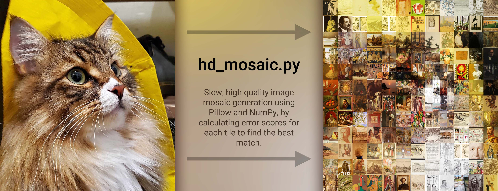

# ImageCollage

A script that creates a photo mosaic by comparing sub-tile pixels for a higher quality result.

  

This script works differently than most others because it doesn't just treat each image tile as one pixel, but instead compares the contents of the image (using a limited, configurable resolution), and finds the best match.

This, of course, is much slower than other methods like mapping tiles to pixels, or just overlaying the source image on the final image. However, the results look much nicer, too (at least, in my opinion).  
In order to speed up the process, imported image tiles are first converted into Numpy arrays, and fast np.array math is used to compare tiles and find the best matches.
